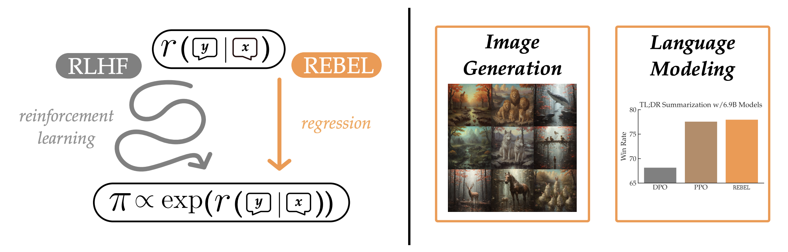

# [REBEL](https://arxiv.org/abs/2404.16767): Reinforcement Learning via Regressing Relative Rewards

Zhaolin Gao, Jonathan D. Chang, Wenhao Zhan, Owen Oertell, Gokul Swamy, Kianté Brantley, Thorsten Joachims, J. Andrew Bagnell, Jason D. Lee, Wen Sun. "REBEL: Reinforcement Learning via Regressing Relative Rewards"



Check out our detailed blog post on reproducing the experiments [here](https://huggingface.co/blog/GitBag/rebel).

## Environment

To replicate the exact environment we used, we recommend installing it with the following command:
```
conda env create -f ./envs/rebel_env.yml
conda env create -f ./envs/vllm_env.yml
```

## TL;DR Summarization

#### Supervised Fine-tuning (SFT)

You can train your own SFT model by running:
```
accelerate launch --config_file accelerate_cfgs/deepspeed_config.yaml \
                  --main_process_port 29085 --num_processes 8 \
                      src/tldr/sft.py \
                      --base_model EleutherAI/pythia-{SIZE}b-deduped \
                      --output_dir models/sft_tldr_pythia_{SIZE}b
```
Alternatively, you can use the existing 2.8B and 6.9B SFT models:
```
vwxyzjn/EleutherAI_pythia-2.8b-deduped__sft__tldr
vwxyzjn/EleutherAI_pythia-6.9b-deduped__sft__tldr
```

#### Reward Model

You can train your own RM model by running:
```
accelerate launch --config_file accelerate_cfgs/deepspeed_config.yaml \
                  --main_process_port 29085 --num_processes 8 \
                      src/tldr/rm.py \
                      --base_model models/sft_tldr_pythia_{SIZE}b
                      --output_dir models/rm_sft_tldr_pythia_{SIZE}b
```
Alternatively, you can use the existing 2.8B and 6.9B RM models:
```
vwxyzjn/EleutherAI_pythia-2.8b-deduped__reward__tldr
vwxyzjn/EleutherAI_pythia-6.9b-deduped__reward__tldr
```

#### REBEL

You can run REBEL by
```
./scripts/tldr/rebel.sh
```

We also include a script for PPO.
```
./scripts/tldr/ppo.sh
```

## General Chat

We apply REBEL on two different sets of models and datasets for general chat.

|  | Base Model | Reward Model | Dataset | Batch Size per Iteration |
| -------- | ------- |  ------- |  ------- | -------- |
| Config 1 | [OpenChat-3.5](https://huggingface.co/openchat/openchat_3.5)   | [Starling-RM-7B-alpha](https://huggingface.co/berkeley-nest/Starling-RM-7B-alpha) | [Nectar](https://huggingface.co/datasets/berkeley-nest/Nectar) | 32 |
| Config 2 | [Meta-Llama-3-8B-Instruct](https://huggingface.co/meta-llama/Meta-Llama-3-8B-Instruct) | [FsfairX-LLaMA3-RM-v0.1](https://huggingface.co/sfairXC/FsfairX-LLaMA3-RM-v0.1) | [UltraFeedback](https://huggingface.co/datasets/openbmb/UltraFeedback) | 32 |
| Config 3 | [Meta-Llama-3-8B-Instruct](https://huggingface.co/meta-llama/Meta-Llama-3-8B-Instruct) | [ArmoRM-Llama3-8B-v0.1](https://huggingface.co/RLHFlow/ArmoRM-Llama3-8B-v0.1) | [UltraFeedback](https://huggingface.co/datasets/openbmb/UltraFeedback) | 60k |

Our preprocessed dataset can be found at [Nectar](https://huggingface.co/datasets/jdchang/nectar_openchat_preprocess), [UltraFeedback](https://huggingface.co/datasets/GitBag/ultrafeedback_llama3_eurus), [Ultrafeedback-Llama-3-Armo-iter_1](https://huggingface.co/datasets/Cornell-AGI/Ultrafeedback-Llama-3-Armo-iter_1), [Ultrafeedback-Llama-3-Armo-iter_2](https://huggingface.co/datasets/Cornell-AGI/Ultrafeedback-Llama-3-Armo-iter_2), and [Ultrafeedback-Llama-3-Armo-iter_3](https://huggingface.co/datasets/Cornell-AGI/Ultrafeedback-Llama-3-Armo-iter_3).

You can run REBEL on Nectar and UltraFeedback by
```
./scripts/nectar/rebel.sh
./scripts/ultrafeedback/rebel.sh
```

Below is a list of models that are trained with the scripts above.

| Model | AlpacaEval 2.0<br>LC Win Rate | AlpacaEval 2.0<br>Win Rate | MT-Bench<br>Average | MMLU<br>(5-shot) | GSM8K<br>(5-shot) |
| :--------: | :--------: |   :--------: | :--------: |  :--------: | :--------: |
| [REBEL-OpenChat-3.5](https://huggingface.co/Cornell-AGI/REBEL-OpenChat-3.5) | 17.3 | 12.8 | 8.06 | 63.7 | 68.8 |
| [REBEL-Llama-3](https://huggingface.co/Cornell-AGI/REBEL-Llama-3) | 30.1 | 32.6 | 8.16 | 65.8 | 75.6 |
| [REBEL-Llama-3-epoch_2](https://huggingface.co/Cornell-AGI/REBEL-Llama-3-epoch_2) | 31.3 | 34.2 | 7.83 | 65.4 | 75.4 |
| [REBEL-Llama-3-Armo-iter_1](https://huggingface.co/Cornell-AGI/REBEL-Llama-3-Armo-iter_1) | 48.3 | 41.8 | 8.13 | 66.3 | 75.8 |
| [REBEL-Llama-3-Armo-iter_2](https://huggingface.co/Cornell-AGI/REBEL-Llama-3-Armo-iter_2) | 50.0 | 48.5 | 8.07 | 65.9 | 75.4 |
| [REBEL-Llama-3-Armo-iter_3](https://huggingface.co/Cornell-AGI/REBEL-Llama-3-Armo-iter_3) | 49.7 | 48.1 | 8.01 | 66.0 | 75.7 |

## RLCM

Please refer to [RLCM](https://github.com/Owen-Oertell/rlcm) repo for the implementation of REBEL on RLCM.

## Cite
Please cite our paper if you use this implementation in your own work:
```
@misc{gao2024rebel,
      title={REBEL: Reinforcement Learning via Regressing Relative Rewards}, 
      author={Zhaolin Gao and Jonathan D. Chang and Wenhao Zhan and Owen Oertell and Gokul Swamy and Kianté Brantley and Thorsten Joachims and J. Andrew Bagnell and Jason D. Lee and Wen Sun},
      year={2024},
      eprint={2404.16767},
      archivePrefix={arXiv},
      primaryClass={cs.LG}
}
```

## Acknowledgments
Thanks for [summarize_from_feedback_details](https://github.com/vwxyzjn/summarize_from_feedback_details/tree/62c37d63c212c55bde52833611eb642a95facb5c) on which this repository is initially based.
